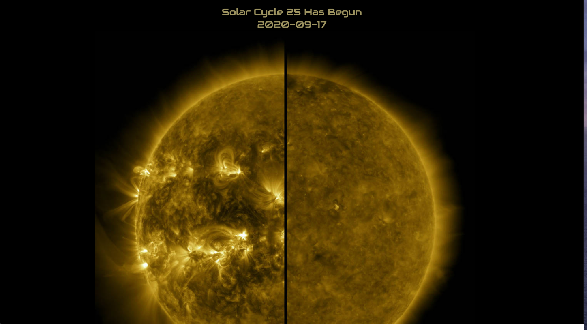
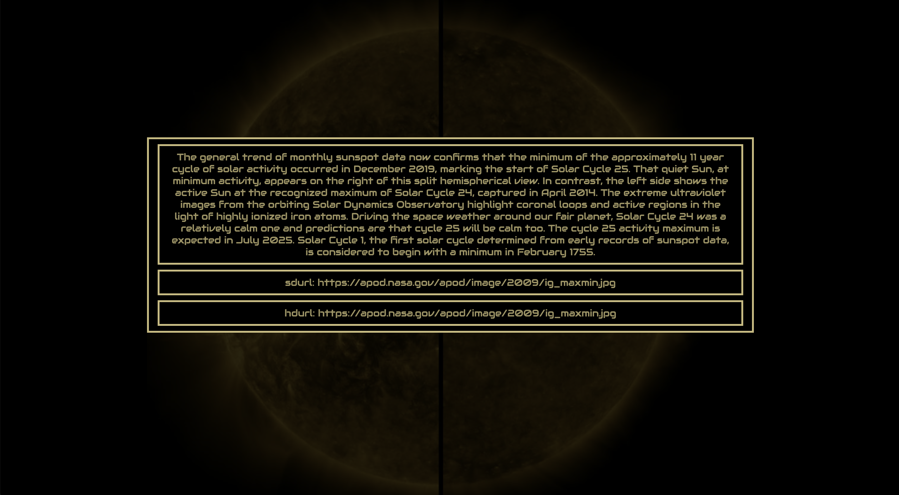

# Stargazer

## About The Project
NASA's Astronomy Pictures of The Day (APOD) are some of the intriguing and beautiful images out there. Stargazer utilizes the NASA APOD api to view high resolution images of this week in space. 

Stargazer an application which fetches the previous week's NASA APODS and allows users to view those images, their information and favorite those images. The user is greeting with a landing page which then transitions to the main navigation page. The user is greeted with the current NASA APOD once landing on the main navigation page. From there the user can navigate through the previous weeks' phots, favoriting images on their way through. Users can visit a favorites page to view all of their favorite images along with url's of each image.

Stargazer is a React application built myself in 6 days.

### Author

**Jordan Shryock**
 * [GitHub](https://github.com/jordy1611)
 * [LinkedIn](https://www.linkedin.com/in/jordan-shryock-6a48b9113/)
 
## Technologies and Tools Used
- React
- React Router
- SASS
- Jest
- React Testing Library
- GitHub Projects

## Installation Instructions

- Clone down this repo
- Run `npm install` from the root directory
- Run `npm start` and visit localhost:3000 in your browser

## APP Demo

* User is greeted with a landing page on initial load

* User can navigate through this week's NASA APOD photos

* User can view info on each image

* User can favorite photos and view them on the favorites page

* User can view their favorited images

* User can view their favorited images's explanations and url's

## Credits
Icons made by [Pixel Perfect](https://www.flaticon.com/authors/pixel-perfect) via [Flaticon](www.flaticon.com)
